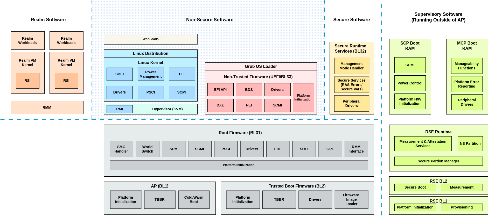

# RD-V3 Cfg1 Prebuilt Software Stack

This repository contains the prebuilt binary components for the Arm **RD-V3-Cfg1** (Reference Design) platform. RD-V3-Cfg1 is a high-performance compute subsystem variant designed to support the **Armv9 Realm Management Extension (RME)**, based on the Neoverse Poseidon-V architecture.

The purpose of this repository is to provide a "ready-to-run" environment for developers to explore RME mechanisms, secure boot flows, and system management on Fixed Virtual Platforms (FVP).



## 🏛 Hardware Architecture Overview

The RD-V3-Cfg1 platform simulates a sophisticated hardware configuration:

- **Compute Cluster**: 8x Neoverse Poseidon-V cores with Direct Connect and 2MB private L2 cache per core.
- **Interconnect**: CMN-Cyprus mesh network (3xMesh).
- **Security Engine (RSE)**: Arm Cortex-M55 for Runtime Security Engine to support Hardware Enforced Security (HES).
- **Control Processors**:
    - **SCP/MCP**: Arm Cortex-M7 for System Control and Manageability.
    - **LCP**: Arm Cortex-M55 Local Control Processors for per-core power management.
- **Expansion**: Multiple AXI ports for I/O Coherent PCIe, Ethernet, and hardware offloading.
    

## 🚀 Getting Started

### 1. Prerequisites

Ensure you have the **Git LFS** client installed before cloning to correctly fetch the binary images:

Bash

```
git lfs install
```

### 2. Clone the Repository

Bash

```
git clone <repository_url>
cd <repository_name>
```

### 3. Launching the Simulation

The stack is configured to run on the `FVP_RD_V3_Cfg1` model. Ensure your FVP environment variables and licenses are correctly set, then execute:

Bash

```
chmod +x run_model.sh
./run_model.sh -v output/rdv3cfg1/grub-buildroot.img
```

## 🛠 Software Stack Components

This prebuilt stack integrates multiple open-source and Arm-specific components to demonstrate RME capabilities:

- **Trusted Firmware-A (TF-A)**: Monitor code supporting EL3 and Realm management.
- **Realm Management Monitor (RMM)**: Manages the lifecycle of Realm VMs at R-EL2.
- **Hafnium**: Acts as the Secure Partition Manager (SPM).
- **SCP/RSE Firmware**: Handles low-level power sequencing and the Root of Trust (RoT).
- **Linux/VirtIO**: Reference OS images with support for Realm world transitions.
    
---

**Note**: This repository is intended for development and evaluation purposes. All binaries are built based on the Arm Reference Implementation.

This repository provides a prebuilt Armv9 RME-enabled software stack for the Neoverse RD-V3-Cfg1 platform, designed for immediate evaluation and development on Fixed Virtual Platforms (FVP).
